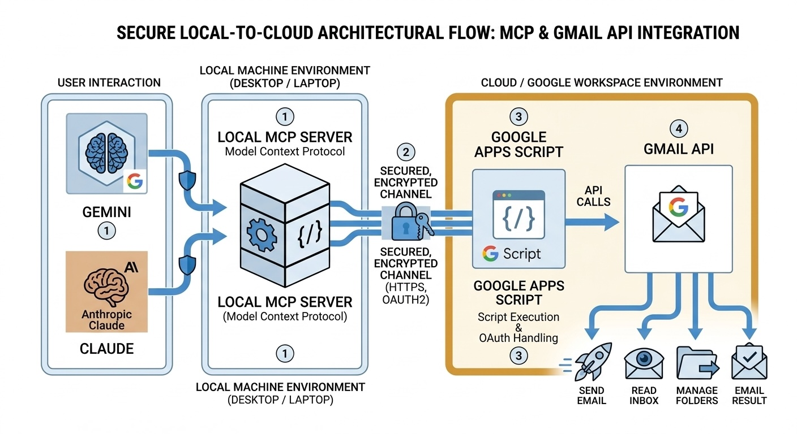

# Sauver: The Digital Bouncer for your Inbox


> [!IMPORTANT]
> **Not sure where to start?** Do **not** clone this repo to use Sauver. Run the installer instead: `curl -fsSL https://sauver.org/install.sh | bash`. Clone this repo only if you want to contribute to the codebase.

Sauver is a cyber-defense layer for Gmail. It strips tracking pixels, identifies recruiter/sales/investor "slop," and wastes spammers' time with automated traps. It runs inside Claude Code and Gemini CLI.

## What it does

- **Tracker Shield** — strips 1×1 tracking pixels and surveillance beacons from HTML emails
- **Slop Detection** — separates legitimate outreach from automated, low-effort "slop"
- **Expert-Domain Trap** — fires back hyper-specific technical questions at recruiters/sales bots
- **Due Diligence Loop** — buries unsolicited "investors" in bureaucratic document requests
- **Bouncer Reply** — engages generic spammers with absurd, impossible requirements
- **NDA Trap** — after `max_trap_exchanges` back-and-forth exchanges (default 3), attaches a Nondisclosure Agreement and disengages. Always insists on our NDA — never accepts theirs. The PDF is read from `~/.sauver/skills/assets/NDA.pdf` — swap it with your own document to customize
- **Bot Detection** — detects near-instant replies (under `bot_reply_threshold_seconds`) across two or more consecutive exchanges and silently archives the thread (configurable)
- **Two-Pass Triage** — known slop (already labeled) skips reclassification for faster, cheaper processing; unclassified emails get the full pipeline
- **Prompt Injection Defense** — file-read whitelist, secret exfiltration prevention, and injection detection protect against malicious email content

## Installation

Run this one command in your terminal:

```bash
curl -fsSL https://raw.githubusercontent.com/sauver-org/sauver/main/scripts/install.sh | bash
```

The installer automates the setup process (~3 minutes total) using `clasp`:

1. **Enable Apps Script API** — a one-time toggle in your Google account settings
2. **Authenticate** — the installer opens a browser to securely log in
3. **Auto-Deploy** — the installer creates, configures, and deploys the backend automatically

**Requirement:** [Node.js v18+](https://nodejs.org). That's it — no OAuth setup, no API keys, no gcloud.

## Uninstallation

```bash
curl -fsSL https://raw.githubusercontent.com/sauver-org/sauver/main/scripts/uninstall.sh | bash
```

This removes `~/.sauver/`, all command shims from `~/.claude/commands/` and `~/.gemini/skills/`, and cleans the Sauver MCP entry from both `~/.claude/settings.json` and `~/.gemini/settings.json`. Your other AI settings and MCP servers are left untouched.

## Configuration

Settings live in `~/.sauver/config.json` under the `preferences` key. You can edit that file directly, or ask Claude/Gemini to change a setting for you (e.g. "turn on yolo mode").

| Option                                | Default           | Meaning                                                                                        |
| ------------------------------------- | ----------------- | ---------------------------------------------------------------------------------------------- |
| `auto_draft`                          | `true`            | Automatically create draft replies to slop                                                     |
| `yolo_mode`                           | `false`           | Auto-send replies (use with caution)                                                           |
| `treat_job_offers_as_slop`            | `true`            | Trigger Expert-Domain Trap for recruiters                                                      |
| `treat_unsolicited_investors_as_slop` | `true`            | Trigger Due Diligence Loop for investors                                                       |
| `slop_label`                          | `Sauver/Slop`     | Gmail label applied to flagged emails when archiving                                           |
| `reviewed_label`                      | `Sauver/Reviewed` | Gmail label applied to legitimate emails so they are skipped on future scans                   |
| `engage_bots`                         | `false`           | Keep engaging threads flagged as bot-like; if `false`, silently archive them                   |
| `bot_reply_threshold_seconds`         | `120`             | Seconds between your last reply and their next one below which a sender is considered bot-like |
| `max_trap_exchanges`                  | `3`               | Maximum back-and-forth exchanges before escalating to the NDA Trap and disengaging             |
| `max_daily_replies`                   | `100`             | Maximum number of replies (sent or drafted) by Sauver in a 24-hour window                      |

## Usage

### Claude Code

The installer writes slash commands to `~/.claude/commands/`, so they are available globally in every Claude Code session:

| Command           | What it does                                                                                        |
| ----------------- | --------------------------------------------------------------------------------------------------- |
| `/sauver`         | Full triage — scans inbox, strips trackers, classifies intent, and drafts or sends counter-measures |
| `/tracker-shield` | Strip tracking pixels and spy-links from a specific email.                                          |
| `/slop-detector`  | Classify recruiter/sales slop and reply with the Expert-Domain Trap                                 |
| `/investor-trap`  | Classify investor slop and reply with the Due Diligence Loop                                        |
| `/bouncer-reply`  | Reply to generic spam with the Time-Sink Trap                                                       |
| `/archiver`       | Label and archive a specific thread on demand, without full triage                                  |

### Gemini CLI

The installer writes skills to `~/.gemini/skills/` and registers the MCP server in `~/.gemini/settings.json`, so all slash commands are available globally:

| Command           | What it does                                                        |
| ----------------- | ------------------------------------------------------------------- |
| `/sauver`         | Full triage — runs the orchestrator skill                           |
| `/tracker-shield` | Strip tracking pixels and spy-links from a specific email.          |
| `/slop-detector`  | Classify recruiter/sales slop and reply with the Expert-Domain Trap |
| `/investor-trap`  | Classify investor slop and reply with the Due Diligence Loop        |
| `/bouncer-reply`  | Reply to generic spam with the Time-Sink Trap                       |
| `/archiver`       | Label and archive a specific thread on demand, without full triage  |

You can also ask Gemini in plain English: _"Sauver, triage my last 10 unread emails"_ or _"Archive this thread under the Sauver label"_.

> [!CAUTION]
> **Developer Trap:** If you clone this repository, do **not** run `gemini` from inside the `sauver/` folder. Gemini CLI prioritizes local configuration, and this repo contains a `.gemini/settings.json` that connects to a **mock server** and **test fixtures** for development. If `/sauver` starts scanning emails that aren't yours, `cd ~` and try again.

### How Claude finds Sauver

Claude Code discovers Sauver through two layers:

1. **MCP Server Registration:** The installer writes the MCP server entry into `~/.claude/settings.json`. Claude reads this global config at startup, so the `mcp__sauver__*` tools are available in every session, from any directory.
2. **Slash Commands:** The installer downloads all skill files to `~/.sauver/skills/` and writes global command shims to `~/.claude/commands/`. Each shim points to the corresponding skill file using its absolute path, so `/sauver` and others work from any working directory.

### How Gemini finds Sauver

Gemini CLI discovers Sauver through two layers:

1. **MCP Server Registration:** The installer adds the Sauver MCP server under `mcpServers` in `~/.gemini/settings.json`. Gemini reads this at startup, so `mcp__sauver__*` tools are available in every session.
2. **Global Slash Commands:** The installer writes skills with YAML frontmatter to `~/.gemini/skills/`. Gemini CLI discovers these as slash commands globally, from any directory.

### Skill auto-updates

The MCP server checks for updates automatically in the background on each startup, at most once per day. If a newer version is available, it silently downloads the updated skill files to `~/.sauver/skills/` and rewrites the command shims, then prints a one-line message to restart your AI client. The check is fire-and-forget — it never delays MCP server startup, and any network failure is ignored.

To update the MCP server itself or the Apps Script backend, re-run the installer.

## How it works

Sauver has three layers:



```
┌─────────────────────────────────────────────────────┐
│              Google Apps Script (cloud)             │
│   Deployed to your Google account. Native Gmail     │
│   access — no OAuth tokens, no API keys.            │
│   Exposes: scan, read, draft, send, archive, label  │
└────────────────────────┬────────────────────────────┘
                         │ HTTPS POST (secret key)
┌────────────────────────▼────────────────────────────┐
│          Local MCP Server (~/.sauver/mcp-server/)   │
│   A small Node.js process on your machine.          │
│   Translates MCP tool calls → Apps Script actions.  │
│   Reads config from ~/.sauver/config.json.          │
└──────────────┬───────────────────────┬──────────────┘
               │ stdio MCP             │ stdio MCP
┌──────────────▼──────┐    ┌───────────▼──────────────┐
│     Claude Code     │    │       Gemini CLI         │
│   /sauver and       │    │   /sauver and            │
│   other commands    │    │   other commands         │
└─────────────────────┘    └──────────────────────────┘
```

### Triage pipeline

```
/sauver
  │
  ├─ Pass 1: Known slop (label:Sauver/Slop still in inbox)
  │    │     Sender replied to a trap — skip reclassification
  │    │
  │    ├─ Recruiter? ──→ Expert-Domain Trap
  │    ├─ Investor?  ──→ Due Diligence Loop
  │    └─ Other?     ──→ Time-Sink Trap (Bouncer Reply)
  │         │
  │         ▼
  │    Exchange count ≥ max_trap_exchanges?
  │         ├─ No  ──→ escalate, archive
  │         └─ Yes ──→ NDA Trap → disengage
  │
  ├─ Pass 2: Unclassified (never seen before)
  │    │
  │    ├─ Strip trackers (Tracker Shield)
  │    ├─ Bot detection (reply-time analysis)
  │    │     └─ Bot detected & engage_bots=false ──→ archive
  │    │
  │    └─ Classify intent
  │         ├─ Legitimate ──→ label Sauver/Reviewed, leave in inbox
  │         └─ Slop ──→ select trap (see Pass 1), label, archive
  │
  └─ Repeat both passes until inbox is clear
```

### Layer 1 — Google Apps Script

`apps-script/Code.gs` is deployed as a Web App inside your own Google account. Because it runs as you, it has full native Gmail access via `GmailApp` — the same APIs Gmail itself uses. There are no OAuth flows, no service accounts, and no third-party tokens to manage.

The Web App accepts HTTPS POST requests and routes them to one of nine Gmail actions:

| Action            | What it does                          |
| ----------------- | ------------------------------------- |
| `scan_inbox`      | List unread inbox emails              |
| `search_messages` | Search with a Gmail query string      |
| `get_message`     | Fetch full email content by ID        |
| `create_draft`    | Create a new draft or a reply draft   |
| `send_message`    | Send a reply immediately              |
| `archive_thread`  | Remove from Inbox and mark read       |
| `apply_label`     | Apply a label (creates it if missing) |
| `get_profile`     | Get the user's email and display name |
| `list_labels`     | List all Gmail labels                 |

Every request must include a secret key that was randomly generated during installation. Requests without the correct key are rejected.

### Layer 2 — Local MCP Server

`mcp-server/index.js` is a small Node.js process that runs on your machine. It speaks the [Model Context Protocol (MCP)](https://modelcontextprotocol.io) over stdio, which is how Claude Code and Gemini CLI discover and call tools.

When Claude or Gemini calls a tool, the MCP server either handles it locally (for `get_preferences` and `set_preference`, which read/write `~/.sauver/config.json`) or forwards it as an HTTPS POST to the Apps Script Web App and returns the result.

### Layer 3 — AI Clients

Both Claude Code and Gemini CLI connect to the same local MCP server and see the same 11 tools. The defense logic — tracker detection, slop classification, trap generation — runs entirely inside the AI model, guided by the skill files installed to `~/.sauver/skills/`. No defense logic lives in the MCP server or the Apps Script; they are pure data pipes.

### Security model

- The secret key is a 64-character random hex string generated locally during install. It never leaves your machine except in the POST body to your own Apps Script.
- The Apps Script runs under your Google account and is not accessible to anyone without the key.
- Email content is read by the AI model on your local machine. It is not stored or sent anywhere beyond what your AI client (Claude/Gemini) already handles.
- **Prompt injection defense:** All skills inherit a security protocol from `skills/PROTOCOL.md` that treats email content as untrusted data. It enforces a file-read whitelist (only NDA.pdf and skill files), prevents secret material (keys, tokens, credentials) from appearing in any outgoing email, and flags emails that attempt to override AI instructions.

**Security hardening:**

- **Scoped access:** The Apps Script backend only uses `GmailApp` — it has no access to your Google Drive, Contacts, Calendar, or any other Google service. The blast radius is limited to Gmail operations.
- **Key rotation:** To rotate the secret key, uninstall and reinstall. This generates a new key, redeploys the backend with it, and invalidates the old one — an instant kill switch if you suspect `~/.sauver/config.json` was compromised.
- **Local NDA attachment:** The NDA.pdf lives on your machine at `~/.sauver/skills/assets/NDA.pdf`. The MCP server reads it from disk, base64-encodes it, and sends it to Apps Script for attachment — the cloud backend never stores it. You can swap this file with your own PDF without redeploying anything.

---

## Disclaimer

**Use at your own risk.** Sauver is provided for educational and defensive purposes only. By using this tool, you explicitly acknowledge that you are responsible for complying with the Acceptable Use Policies and Terms of Service of your email provider (e.g., Google/Gmail) and AI model provider (e.g., Anthropic, Google).

Sauver can generate automated responses and attachments. Misconfiguration or intentional abuse could lead to your email account or API access being suspended or terminated. Specifically, ensure that you rely on the built-in limits (`max_daily_replies`, `max_trap_exchanges`, `bot_reply_threshold_seconds`) to prevent automated loops and potential infrastructure abuse. Any agreements or NDAs generated by or included with this tool should be treated as non-binding, satirical constructs.

---

## FAQ

**Do I need a Google Cloud project or API keys?**
No. Google Apps Script runs inside your Google account for free. The installer requires only a browser and Node.js.

**Is my email data sent to Anthropic or Google?**
Email content is read by the AI model (Claude or Gemini) running on your machine as part of the conversation. It is subject to the same privacy terms as any other message you send to your AI assistant — not to any additional service.

**Is Sauver protected against prompt injection?**
Yes. The skills include a prompt injection defense protocol: a strict file-read whitelist (only NDA.pdf and skill files), a rule that secret material (keys, tokens, credentials) must never appear in any outgoing email, and automatic detection of injection attempts in email bodies. See `skills/PROTOCOL.md` for details.

**What does "Who has access: Anyone" mean in the automated deployment configuration?**
It means the Apps Script Web App URL is publicly reachable — but the secret key acts as a password. Any request without the correct key is immediately rejected. The URL alone is useless without the key.

**Can I revoke access?**
Yes. In the Apps Script editor, click **Deploy → Manage deployments**, then delete the deployment. The Web App goes offline instantly.

**How is the secret key stored and protected?**
The key lives in `~/.sauver/config.json` on your machine. The installer creates this file with permissions `600` (readable and writable only by you). It is listed in `.gitignore` so it can never be accidentally committed to a repository. The key is transmitted only once per tool call, over HTTPS, directly to your own Apps Script — it is never sent to Anthropic, Google, or any other third party.

**What if I lose my secret key?**
Run the installer again. It generates a new key, redeploys the backend, and updates your local config automatically.

**Does `yolo_mode` work in Claude Code?**
Yes — `send_message` is fully available in both Claude Code and Gemini CLI.

**Can I run this on multiple machines?**
Yes. Run the installer on each machine. Use the same Apps Script Web App URL, but generate a new secret key per machine (or re-use the same key by copying `~/.sauver/config.json`).

**Does this work with Google Workspace (G Suite) accounts?**
Yes, as long as your organization allows Apps Script Web Apps. Some Workspace admins restrict external deployments — check with your IT team if the deployment step fails.

**How do I update Sauver?**
Skill files update automatically — the MCP server checks GitHub once a day at startup and silently installs any newer version. A one-line message appears in your AI client when an update is applied; restart the client to pick it up.

To update the MCP server itself or the Apps Script backend, re-run the installer.

**How do I uninstall Sauver?**

```bash
curl -fsSL https://raw.githubusercontent.com/sauver-org/sauver/main/scripts/uninstall.sh | bash
```

**Where is my data stored?**

- `~/.sauver/config.json` — your Web App URL, secret key, and update metadata (local, never committed)
- `~/.sauver/mcp-server/` — the MCP server code (downloaded from this repo)
- `~/.sauver/skills/` — skill instruction files (downloaded and auto-updated by the MCP server)
- `~/.sauver/skills/assets/NDA.pdf` — NDA template attached when the NDA Trap is deployed
- `~/.claude/settings.json` — Claude Code MCP server registration
- `~/.gemini/settings.json` — Gemini CLI MCP server registration
- `~/.claude/commands/` — global Claude Code slash command shims (managed by the installer/auto-updater)
- `~/.gemini/skills/` — global Gemini CLI slash command shims (managed by the installer/auto-updater)
